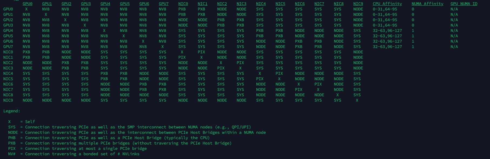

# nccl-precheck

Pre-check for NCCL Test


## GPU

### Disable PCIe ACS
IO virtualization (also known as VT-d or IOMMU) can interfere with GPU Direct by redirecting all PCI point-to-point traffic to the CPU root complex, causing a significant performance reduction or even a hang. 
You can check whether ACS is enabled on PCI bridges by running:

sudo lspci -vvv | grep ACSCtl
If lines show “SrcValid+”, then ACS might be enabled. 
Looking at the full output of lspci, one can check if a PCI bridge has ACS enabled.

```shell
sudo lspci -vvv
```
If PCI switches have ACS enabled, it needs to be disabled. 
On some systems this can be done from the BIOS by disabling IO virtualization or VT-d.
For Broadcom PLX devices, it can be done from the OS but needs to be done again after each reboot.

Use the command below to find the PCI bus IDs of PLX PCI bridges:

```shell
sudo lspci | grep PLX
```
Next, use setpci to disable ACS with the command below, replacing 03:00.0 by the PCI bus ID of each PCI bridge.

```shell
sudo setpci -s 03:00.0 ECAP_ACS+0x6.w=0000
```
Or you can use a script similar to this:

```shell
for BDF in `lspci -d "*:*:*" | awk '{print $1}'`; do

    # skip if it doesn't support ACS
    setpci -v -s ${BDF} ECAP_ACS+0x6.w > /dev/null 2>&1
    if [ $? -ne 0 ]; then
            #echo "${BDF} does not support ACS, skipping"
            continue
    fi

    logger "Disabling ACS on `lspci -s ${BDF}`"
    setpci -v -s ${BDF} ECAP_ACS+0x6.w=0000
    if [ $? -ne 0 ]; then
        logger "Error disabling ACS on ${BDF}"
            continue
    fi
    NEW_VAL=`setpci -v -s ${BDF} ECAP_ACS+0x6.w | awk '{print $NF}'`
    if [ "${NEW_VAL}" != "0000" ]; then
        logger "Failed to disable ACS on ${BDF}"
            continue
    fi
done
```

### GPU-to-NIC communication
GPUs can also communicate directly with network cards using GPU Direct RDMA (GDRDMA). This requires having a compatible network cards and drivers, plus loading an extra kernel module called nvidia-peermem. The nvidia-peermem module is now supplied with the CUDA drivers, however it must be loaded on each node boot with:

```shell
modprobe nvidia-peermem
```
GDRDMA can also be enabled by using the DMA-BUF feature of recent Linux kernels combined with the Open Source Nvidia GPU driver. In this case, NCCL will automatically detect and enable DMA-BUF so the nvidia-peermem module will not be necessary.


### Enable GPU performance mode

```shell
nvidia-smi -pm 1
```
## Networking

### Check IB netnic linkup

```shell
ibstatus | grep -A 1 "phys state:.*LinkUp"
        phys state:      5: LinkUp
        rate:            400 Gb/sec (4X NDR)
--
        phys state:      5: LinkUp
        rate:            400 Gb/sec (4X NDR)
--
        phys state:      5: LinkUp
        rate:            400 Gb/sec (4X NDR)
--
        phys state:      5: LinkUp
        rate:            200 Gb/sec (2X NDR)
--
        phys state:      5: LinkUp
        rate:            400 Gb/sec (4X NDR)
--
        phys state:      5: LinkUp
        rate:            400 Gb/sec (4X NDR)
--
        phys state:      5: LinkUp
        rate:            400 Gb/sec (4X NDR)
--
        phys state:      5: LinkUp
        rate:            400 Gb/sec (4X NDR)
--
        phys state:      5: LinkUp
        rate:            400 Gb/sec (4X NDR)
```
### Check IB NIC link status

```shell

mst status -v | grep -i x7 | grep mlx | awk '{print $3, $4}' | while read busid mlx_num; do
    printf "MLX Number: %s " "$mlx_num"; lspci -vv -s "$busid" | grep -i 'lnksta:' | tr '\n' ' '; echo
done

MLX Number: mlx5_0              LnkSta: Speed 32GT/s, Width x16 
MLX Number: mlx5_1              LnkSta: Speed 32GT/s, Width x16 
MLX Number: mlx5_2              LnkSta: Speed 32GT/s, Width x16 
MLX Number: mlx5_3              LnkSta: Speed 32GT/s, Width x16 
MLX Number: mlx5_4              LnkSta: Speed 32GT/s, Width x16 
MLX Number: mlx5_5              LnkSta: Speed 32GT/s, Width x16 
MLX Number: mlx5_6              LnkSta: Speed 32GT/s, Width x16 
MLX Number: mlx5_7              LnkSta: Speed 32GT/s, Width x16 
MLX Number: mlx5_8              LnkSta: Speed 32GT/s, Width x16 

```
link speed downgraded example

```shell
MLX Number: mlx5_107            LnkSta: Speed 16GT/s (ok), Width x16 (ok)
MLX Number: mlx5_106            LnkSta: Speed 16GT/s (ok), Width x4 (downgraded)
MLX Number: mlx5_104            LnkSta: Speed 16GT/s (ok), Width x16 (ok)
MLX Number: mlx5_103            LnkSta: Speed 16GT/s (ok), Width x16 (ok)
MLX Number: mlx5_102            LnkSta: Speed 16GT/s (ok), Width x16 (ok)
MLX Number: mlx5_101            LnkSta: Speed 16GT/s (ok), Width x16 (ok)
MLX Number: mlx5_105            LnkSta: Speed 16GT/s (ok), Width x16 (ok)
MLX Number: mlx5_100            LnkSta: Speed 16GT/s (ok), Width x16 (ok)
```

### Check nvidia-smi topo 

| Connection Type     | Meaning                                                                                                                  | NCCL Performance Impact                                                                 |
| ------------------- | ------------------------------------------------------------------------------------------------------------------------ | --------------------------------------------------------------------------------------- |
| `NV#` (NV1/NV2/NV4) | Connected via **NVLink**. The number indicates the NVLink generation or number of links (e.g., NV4 = 4 links or 4th gen) | ✅ **Best performance**. High bandwidth and low latency. Preferred by NCCL.              |
| `PIX`               | Peer-to-peer over PCIe on the **same switch**                                                                            | 🟡 Fairly good. Slower than NVLink. Bandwidth limited by PCIe switch.                   |
| `PXB`               | Peer-to-peer over PCIe via **different switches**                                                                        | 🟠 Moderate performance. Slower than PIX. May involve host PCIe root complex traversal. |
| `PHB`               | Peer-to-peer via **PCIe Host Bridge** (e.g., across CPU sockets)                                                         | 🔴 Poor performance. Typically cross-NUMA. Higher latency and lower bandwidth.          |
| `NODE`              | GPUs are on **different NUMA nodes**                                                                                     | 🔴 Even worse latency. Usually combined with PHB. Major NCCL bottleneck.                |
| `SYS`               | Communication across systems (e.g., no direct connection, via network)                                                   | ❌ **Worst performance**. Indicates no suitable direct path. Avoid for NCCL.             |

example A800 

```shell
nvidia-smi topo -m 
```
